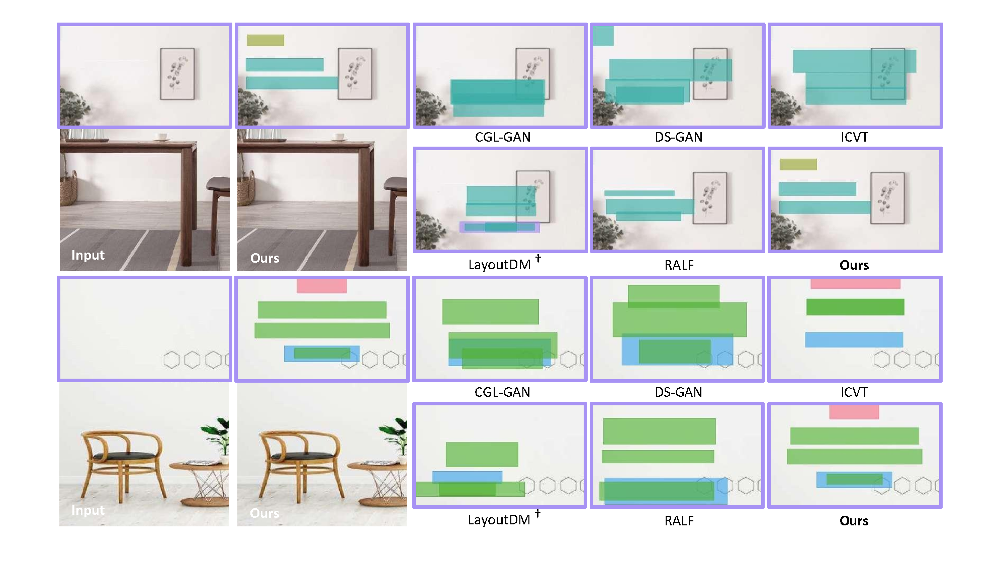

<h1 align="center"> CGB-DM: Content and Graphic Balance Layout Generation with Transformer-based Diffusion Model</h1>

<div align="center">

 <a href=''></a> &nbsp;&nbsp;&nbsp;&nbsp;&nbsp;
 <a href='https://yuli0103.github.io/CGB-DM.github.io/'></a> &nbsp;&nbsp;&nbsp;&nbsp;&nbsp;
 
_**[Yu Li](https://github.com/yuli0103/), [Yifan Chen](), [Gongye Liu](https://github.com/GongyeLiu), [Jie Wu](), [Yujiu Yang*](https://scholar.google.com/citations?user=4gH3sxsAAAAJ&hl=zh-CN&oi=ao)**_

Tsinghua University
<br>
(* corresponding authors)

</div>

<p align="center">
  
</p>

## Setup

1. Create a conda enviroment:

```bash
conda env create -n desigen python=3.8
conda activate desigen
pip install -r requirements.txt
```

2. Download checkpoints
   (1) cgb-dm checkpoint
   (2) is-net checkpoint
   (3) basnet checkpoint

## Dataset & Pre-process
1. Download data
   url
   dataset structure
2. how to preprocess with your data
   (1) inpaint
   (2) saliency detection
   (3) get saliency detection box

## Usage
### Modify the configuration file

### Training
Run the commands in terminal
```bash
# You can choose the training dataset and task (unconstrained and constrained generation)
python scripts/train.py --gpuid 0 --dataset pku --task uncond
```

### Inference 

Generate background images with the prompts on validation set and evaluate them by the proposed metrics: FID, Salient Ratio and CLIP Score.

The pretrained saliency dectection mode can be download on [Basnet](https://github.com/xuebinqin/BASNet) and placed on `salliency` directory.

```bash
sh test.sh
```
### Inference with a single image


## Citation

```tex

```
